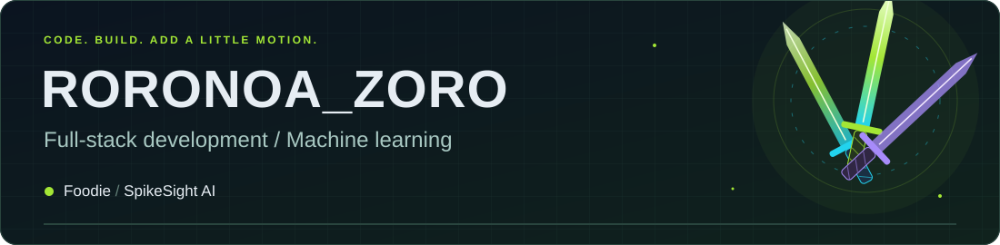

  

  <strong>Full-stack web development · machine learning · animated interfaces</strong> 
  Building useful products, from restaurant workflows to VALORANT match insights.

## 🚀 Project spotlight

<table>
<tr>
<td width="50%" valign="top">

<h3>🍽️ Foodie</h3>

<strong>Full-Stack Restaurant Management System</strong>

<ul>
  <li>Menu browsing, shopping carts, ordering, and delivery tracking.</li>
  <li>JWT authentication, email/SMS OTP verification, and role-based access.</li>
  <li>Admin dashboards for dishes, users, customer reviews, and sales analytics.</li>
  <li>AI-generated dish descriptions and taglines, image discovery, and USD/CFA currency support.</li>
</ul>

<strong>Stack</strong> HTML · CSS · JavaScript · Node.js · Express.js · MongoDB · JWT · OpenAI/OpenRouter APIs

<strong>⏳ Public upload coming soon</strong>

<!-- Add Foodie's verified repository and demo links after the project is uploaded. -->

</td>
<td width="50%" valign="top">

<h3>🎯 SpikeSight AI</h3>

<strong>VALORANT Match Prediction &amp; Analytics Platform</strong>

<ul>
  <li>Match prediction models using Elo ratings and regularized logistic regression.</li>
  <li>Chronological data pipelines with timestamp validation and point-in-time features.</li>
  <li>REST APIs for forecasts, team rankings, map analysis, and event brackets.</li>
  <li>Interactive dashboards for matchups, team profiles, and model performance.</li>
</ul>

<strong>Stack</strong> Python · FastAPI · Next.js · React · TypeScript · SQLite

<strong>⏳ Public upload coming soon</strong>

<!-- Add SpikeSight AI's verified repository and demo links after the project is uploaded. -->

</td>
</tr>
</table>

## ⚔️ About me

<table>
<tr>
<td width="65%" valign="middle">

I’m **Roronoa_Zoro**, a developer working across web applications and machine learning.

I enjoy building complete workflows: interfaces people can use, APIs that support them, and models that turn data into insights.

Animation is part of my style. A little motion makes an interface feel alive.

**Currently preparing Foodie and SpikeSight AI for their public GitHub debut.**

</td>
<td width="35%" align="center" valign="middle">
  
</td>
</tr>
</table>

## 🧰 Toolbox

  
  
  
  
  
  

  
  
  
  
  

**Also working with:** HTML, CSS, JWT authentication, Elo ratings, logistic regression, and generative AI APIs.

  

📊 GitHub activity

  

Thanks for visiting. More projects are on the way. ⚔️

